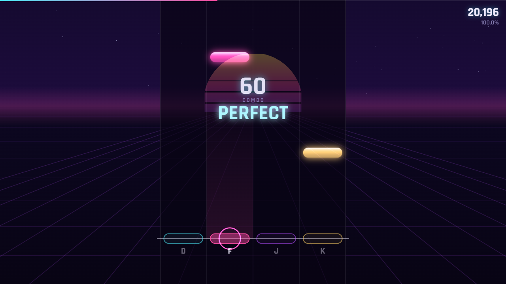

# 🎹 PULSEFALL

**Every track is born the moment you press play.**

### ▶ [Play it now](https://pulsefall-production.up.railway.app) — sound on 🔊

A 4-lane rhythm game with no audio files. The music — synthwave kicks, snares, basslines, pads, and lead melodies — is composed and synthesized **live in your browser** with the Web Audio API. The beatmap is derived from the same generated score, so every note you hit is perfectly synced to the sound by construction.



## How to play

- Notes fall down four lanes — hit **D F J K** (or arrow keys, or tap the lanes) when they cross the line
- **PERFECT / GREAT / GOOD / MISS** timing judgment with early/late hints
- Chain hits to build combo; finish for a grade (**SS / S / A / B / C / D**) and a Full Combo badge
- **Calibrate** — tap along to a metronome for 8 beats and the game measures your personal audio latency

## Tracks

**The Classics — public-domain bangers, hip-hop arrangements:**

| Track | BPM | Style | Composer |
|---|---|---|---|
| Für Elise | 90 | boom bap + vinyl crackle | Beethoven, 1810 |
| Mountain King | 140 | trap | Grieg, 1875 |
| The Entertainer | 92 | old school swing | Scott Joplin, 1902 |

Every classic is an **original arrangement of a public-domain composition** — melodies transcribed from scores whose composers died over a century ago, drums and 808s composed in-house, zero recordings sampled. Fully legal, instantly recognizable.

**The Bangers — original tracks in modern pop styles:**

| Track | BPM | Style |
|---|---|---|
| Hyperglow | 150 | hyperpop / bubblegum bass |
| Venom | 143 | dark Y2K pop, chromatic staccato |
| Nightswim | 138 | sped-up melodic club — the bassline is the hook |

These are original compositions written for the game in the style of modern pop — genre and vibe aren't copyrightable, melodies are, so the melodies are ours.

**The Synthetics — procedurally composed:**

| Track | BPM | Mood |
|---|---|---|
| Neon Runner | 122 | classic drive |
| Midnight Drive | 100 | late-night chill |
| Overdrive | 146 | peak-hour chaos |
| **Daily Drop** | varies | a brand-new track every day, same for everyone — share your grade |

Three difficulties (Easy / Normal / Hard) with different note density, approach speed, and chords on Hard.

## Tech

Zero engine, zero assets — vanilla JavaScript, Canvas 2D, Web Audio:

- **Procedural composer**: seeded PRNG generates a full song structure (intro → verse → chorus → bridge → outro) over a chord progression, with a pentatonic random-walk melody that snaps to chord tones on strong beats
- **Synthesized instruments**: pitch-dropping sine kick, noise-burst snare, filtered saw bass, detuned-saw leads through a feedback echo bus, slow-attack pads
- **Sample-accurate scheduling** via the Web Audio clock (lookahead scheduler) — the game clock *is* the audio clock, so judgment never drifts
- **Beatmap generator**: music events become note candidates (melody > snare > kick > hats), filtered by per-difficulty minimum gaps, lanes assigned by melodic contour
- Tap-to-calibrate latency offset, audio-reactive synthwave background (grid and sun pulse on the actual beat)

## Run locally

```bash
npm install
npm start
# → http://localhost:4311
```

## License

MIT
